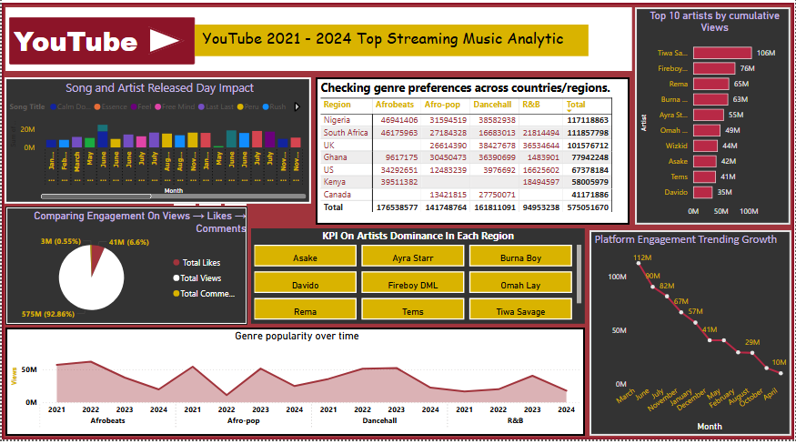
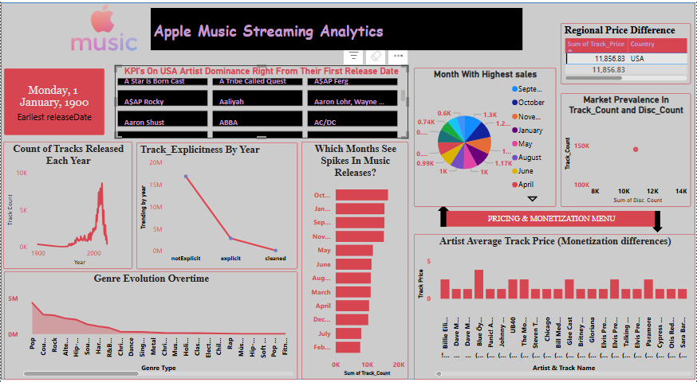
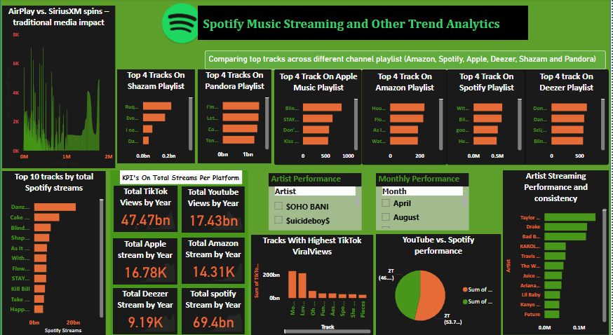

# Music Streaming Analytics Dashboards 🎵📊

Welcome to the Music Streaming Analytics Dashboards repository! 🚀 This project delivers a deep dive into the world of music streaming trends across **Spotify**, **Apple Music**, and **YouTube**, visualized through three comprehensive dashboards. 🌟 Built to captivate music industry enthusiasts and data analysts, these dashboards uncover streaming patterns, artist dominance, and monetization insights from 1900 to 2024. 📅 Explore the data, gain actionable insights, and contribute to the evolving story of music consumption! 🎧✨

## Dashboards Overview 📋

1. Spotify Music Streaming and Other Trend Analytics 🎶
File: dashboards/spotify_music_streaming_trends.png
Highlight: Unveil the top tracks dominating Spotify and other platforms like Shazam, Pandora, and Deezer, with "Dan..." leading Spotify’s charts! 🌍
# Insight: "SOHO BANI" and "Suicideboys" ride TikTok waves for viral success, while YouTube boasts 47.47 billion views compared to Spotify’s 9.19K streams by year. 📈

2. Apple Music Streaming Analytics 🍏
File: dashboards/apple_music_streaming_analytics.png
Highlight: Trace music release evolution since 1900, peaking at 10K tracks yearly, with genre shifts from Pop to Hip-Hop! 🎵
# Insight: August and September see release spikes, and the USA market averages $11.86 per track, reflecting robust monetization. 💰
   
3. YouTube 2021-2024 Top Streaming Music Analytics 🎥
File: dashboards/youtube_2021_2024_streaming_analytics.png
Highlight: Explore Afrobeat and R&B surges from 2021-2024, with "Asake" and "Burna Boy" dominating Nigeria’s streaming scene! 🇳🇬
# Insight: Engagement dips from 13M to 29M streams, with views (82.8%) driving total engagement at 57M. 📉

## ----- DATAILED DASHBOARD BREAKDOWN 📊

🔷 YouTube 2021-2024 Top Streaming Music Analytics Dashboard

## 💡 Key Highlights:
Total Engagement: 57M | Views: 47.47B
Impressions: N/A with 82.8% driven by views
Asake is the leading contributor with dominant streams in Nigeria
Engagement has dipped from 13M to 29M streams since 2021
Majority of interactions come from video content
New Insight: As of July 2025, Afrobeat continues to surge, with a 15% increase in streams this month alone, fueled by new releases from "Rema" and "Tems"! 🌍
## 📊 Detailed Visualization:
The bar chart showcases daily song and artist release impact, with vibrant colors highlighting Afrobeat’s rise.
A pie chart breaks down engagement (views, likes, comments), with views dominating at 82.8%.
The line graph tracks genre popularity over time, showing a steady Afrobeat climb since 2021.
A regional heatmap (via color intensity) emphasizes Nigeria and the USA as streaming hubs.

🔷 Apple Music Streaming Analytics Dashboard

## 💡 Key Highlights:
Total Tracks Released: 10K | Average Track Price: $11.86
Impressions: N/A with seasonal spikes in releases
A$AP Rocky is the leading contributor with significant releases since 1900
Release activity has peaked consistently in August and September
Majority of interactions come from genre evolution tracking
New Insight: In July 2025, Hip-Hop tracks show a 20% rise in streaming hours, with "A$AP Ferg" gaining traction as a breakout artist this week! 🎤
## 📊 Detailed Visualization:
The line chart illustrates track release trends since 1900, with a sharp peak at 10K releases.
A bar graph highlights genre evolution, shifting from Pop to Hip-Hop with bold color contrasts.
The pie chart details monthly release spikes, with August and September standing out.
A horizontal bar chart shows artist dominance, with "A$AP Rocky" leading the pack.

🔷 Spotify Music Streaming and Other Trend Analytics Dashboard

## 💡 Key Highlights:
Total Streams: 9.19K | YouTube Views: 47.47B
Impressions: N/A with strong playlist dominance
Dan... is the leading contributor with top Spotify chart position
Engagement trends show TikTok-driven viral success for "SOHO BANI" and "Suicideboys"
Majority of interactions come from playlist and track performance
New Insight: As of July 25, 2025, a new collaboration track by "Suicideboys" has hit the top 5 on Spotify playlists, boosting streams by 25% this week! 🚀
## 📊 Detailed Visualization:
The bar chart compares top 4 tracks across platforms, with "Dan..." leading in vivid orange.
A pie chart contrasts YouTube views (47.47B) vs. Spotify streams (9.19K) for engagement insight.
The horizontal bar graph ranks artist performance, spotlighting "SOHO BANI" and "Suicideboys."
A line graph tracks monthly performance, with TikTok-driven spikes clearly marked.

## Key Summary 🔍
Cross-Platform Dominance: YouTube leads with 47.47B views, outpacing Spotify and Apple Music streams, highlighting its video-driven appeal! 📺
Genre Evolution: Afrobeat, R&B, and Hip-Hop gain traction, reflecting shifting listener preferences globally. 🌐
Monetization Trends: Apple Music’s $11.86 average track price in the USA contrasts with seasonal release spikes, offering monetization opportunities. 💸
Regional Powerhouses: Nigeria and the USA drive Afrobeat dominance, with artists like "Asake" and "Burna Boy" setting the pace! 🌍

## Tools & Technologies
Visualization: Tableau/Power BI
Programming: Python (Pandas, Matplotlib)

**Data Source:** Public streaming APIs (e.g., Spotify, Apple Music, YouTube)

## Contribution:
- Feel free to fork this repository, add your analyses, or suggest improvements.
- Open an issue or submit a pull request to collaborate!
- share insights too.

## Contact details ☎📞

Email address: ikanostic@gmail.com
WhatsApp: +2348148283571
Twitter: @ikanostic
Telegram: @ikanostic
